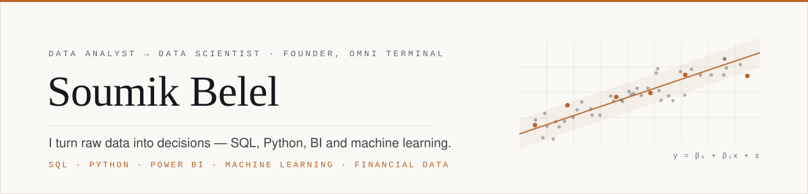

<picture>

  <source media="(prefers-color-scheme: dark)" srcset="./assets/banner-dark.svg">
  <source media="(prefers-color-scheme: light)" srcset="./assets/banner-light.svg">
  
</picture>

I'm a data scientist and a solo founder. I build **Omni Terminal** — a research and analytics
terminal for Indian equity and derivatives markets — end to end, from market-data ingestion and
quantitative models through to the API and the interface.

Everything on this profile points in the same direction: taking raw market data and turning it
into something a trader can actually reason with.

**[LinkedIn](https://www.linkedin.com/in/soumik-belel)** · **[X](https://x.com/SoumikBelel)** · **[Email](mailto:soumikbelel3@gmail.com)** · **[Omni Terminal ↗](https://omni-terminal-nu.vercel.app)**

---

## Currently

|  |  |
| :--- | :--- |
| **Building** | **Omni Terminal** — EOD-first NSE/BSE data pipeline, options-chain and open-interest analytics, factor scoring, screening and backtesting. Core modules are built; I'm hardening the data layer and rebuilding the front end in Next.js. |
| **Learning** | Next.js App Router and SSR for public market pages · CFA Level 1–3 material, for the concepts rather than the charter · distribution and growth. |
| **Writing** | Daily markets and finance content as **The Architect** (English) and **Baniyon Ka Guruji** (Hindi/Hinglish). |
| **Reading** | Anything on market microstructure, factor investing, and how small teams ship infrastructure. |

> **Open to remote Data Analyst / Data Scientist roles**, working from Kolkata. Financial data is where I'm sharpest, but I'm just as happy on general analytics and ML work — [soumikbelel3@gmail.com](mailto:soumikbelel3@gmail.com).

---

## The thesis

Indian retail traders have no shortage of charts. What they don't have is context — the flows,
the positioning, the option-chain structure and the historical base rates that make a chart mean
something. Institutions pay lakhs a year for that context. That gap is what I'm building into.

The constraint I've set myself: the terminal explains the market, it never tells anyone what to
buy. Research infrastructure, not tips.

---

## Selected work

### Markets & quantitative

| Project | What it does | Stack |
| :--- | :--- | :--- |
| **Omni Terminal** — [live ↗](https://omni-terminal-nu.vercel.app) | Research and analytics terminal for NSE/BSE. Multi-asset pre-session analysis, custom charting, screening, backtesting, and an AI research layer. | FastAPI · React · TimescaleDB · Redis · VectorBT |
| **[Gold Pre-Session Dashboard](https://github.com/soumikbelel3-commits/gold-trading-execution)** | Institutional-style pre-session workspace for gold: composite alpha signals, multi-timeframe technicals, and macro scoring in a Bloomberg-inspired UI. | Python · pandas |
| **[TCS Quant Trading Guide](https://github.com/soumikbelel3-commits/TCS-Quant-Trading-Guide)** | A full quant pipeline worked end to end on a single name — data collection, EDA, indicators, strategy backtesting, ML prediction, risk management, portfolio optimisation. | Python · pandas · scikit-learn |
| **[Trader Behaviour & Performance](https://github.com/soumikbelel3-commits/-trader-behavior-and-performance)** | Connects Fear/Greed market sentiment to behavioural segments and realised trading performance. | Python · pandas |

### Data science & analytics

| Project | What it does | Stack |
| :--- | :--- | :--- |
| **[European Bank Churn](https://github.com/soumikbelel3-commits/european-bank-churn)** | Customer-attrition prediction with key-driver diagnosis and retention strategies that follow from the model, not around it. | Python · scikit-learn |
| **[Global Supply Chain Risk](https://github.com/soumikbelel3-commits/Global_supply_chain_risk_2026-)** | Disruption-exposure mapping across regions and shipping lanes, delivered as interactive dashboards. | Python · Power BI |
| **[Retail Sales & Inventory Intelligence](https://github.com/soumikbelel3-commits/retail-sales-inventory-intelligence)** | An intelligence layer over retail operations: sales trends, stock-out risk, replenishment cues. | Python · SQL · JavaScript |
| **[Superstore Sales Dashboard](https://github.com/soumikbelel3-commits/Superstore-sale-dashboard)** | Category, regional and margin clarity from a Python/SQL pipeline into Power BI. | Python · SQL · Power BI |
| **[Instructor Effectiveness Modeling](https://github.com/soumikbelel3-commits/Instructor-Effectiveness-Modeling)** | Modelling what actually drives instructor outcomes in an EdTech setting. | Python · Jupyter |

### Products

| Project | What it does | Stack |
| :--- | :--- | :--- |
| **[AI Resume Analyzer](https://github.com/soumikbelel3-commits/ai-resume-analyzer)** | ATS scoring, job-match intelligence, and a Gemini-powered review engine. | Next.js · TypeScript · Prisma |
| **[ClearLedger](https://github.com/soumikbelel3-commits/clearledger)** | Marketing site for a fintech product, built for speed and conversion. | Next.js · TypeScript |
| **[Sanatani Bhakti](https://github.com/soumikbelel3-commits/sanatani-bhakti)** | All-in-one Hindu devotional platform with multi-language i18n and a deliberately calm UX. | Next.js · TypeScript |

Also here: [AI Strategy Backtester](https://github.com/soumikbelel3-commits/ai-strategy-backtester) ·
[Cricbuzz Live Stats](https://github.com/soumikbelel3-commits/Cricbuzz_livestats) ·
[Real Estate Price Prediction](https://github.com/soumikbelel3-commits/real-estate-price-prediction) ·
[Shopper Spectrum](https://github.com/soumikbelel3-commits/shopper-spectrum) ·
[US Airline Performance](https://github.com/soumikbelel3-commits/us-airline-performance-analysis) ·
[FedEx Supply Chain](https://github.com/soumikbelel3-commits/Fed-Ex-Supply-Chain) ·
[IPL Data Analysis](https://github.com/soumikbelel3-commits/IPL-Data-Analysis)

---

## Toolkit

|  |  |
| :--- | :--- |
| **Data & modelling** | Python · SQL · pandas · NumPy · scikit-learn · statsmodels |
| **Quant** | VectorBT · Alphalens · PyPortfolioOpt · py_vollib · QuantLib · FinBERT |
| **BI & reporting** | Power BI · DAX · Tableau · Excel · Jupyter |
| **Backend** | FastAPI · Node.js · REST APIs · Celery |
| **Frontend** | TypeScript · Next.js · React · Tailwind · TanStack Query · Zustand |
| **Data stores** | PostgreSQL · TimescaleDB · Redis · pgvector · Prisma |
| **Infrastructure** | Docker · Nginx · Cloudflare · Vercel · Git |

---

## Activity

  
  

  
  

---

Kolkata, India · [linkedin.com/in/soumik-belel](https://www.linkedin.com/in/soumik-belel) · [@SoumikBelel](https://x.com/SoumikBelel) · [soumikbelel3@gmail.com](mailto:soumikbelel3@gmail.com)
